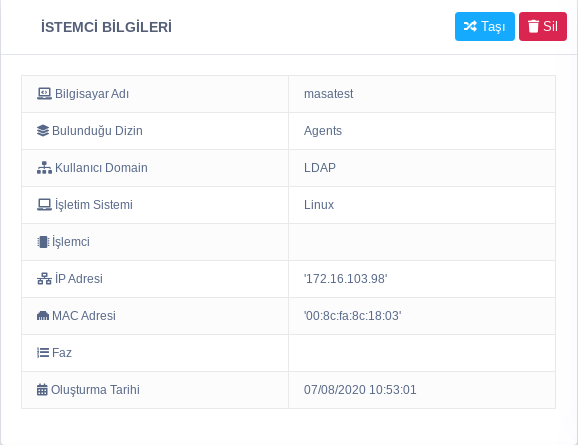

**İstemci Bilgileri**

İstemci bilgileri eklentisinde makinenin bilgisayar adı,  Bulunduğu Dizin, Kullanıcı Domain, İşletim Sistemi, İşlemci, IP Adresi, MAC Adresi, Faz ve Oluşturma Tarihi bilgilerinin anlık olarak kullanıcıya gösterildiği kısımdır.

