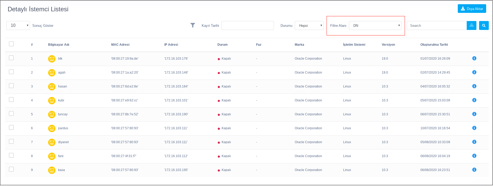

**Raporlar**

Raporlar kısmında istemcilerin detaylı raporları ve bilgileri verilir. İstemcilerin : 
Bilgisayar Adı,	MAC Adresi, IP Adresi,	Durum, Faz	Marka, İşletim Sistemi,	Versiyon
ve Oluşturulma Tarihi bilgileri gözlemlenir.

Dışa Aktar butonu  istemcilerin bütün bilgileri pdf formatında dışa aktarılır.

Kayıt Tarihi kısmından seçilen 2 tarih arasında kurulan istemcilerin bilgileri filtrelebilir.

Durum kısmında açık, kapalı ve hepsi olmak üzere anlık durumlarına göre istemciler filtrelebilir.

Filtre Alanı kısmında uygulanacak filtrelemeler sayesinde istemcilerin DN, JID, Bilgisayar Adı, IP Adresi, MAC Adresi,
İşletim Sistemi, İşletim Sistemi Versiyonu, Marka, Model, Bellek, Disk ve Faz şeklinde sıralanabilir.

