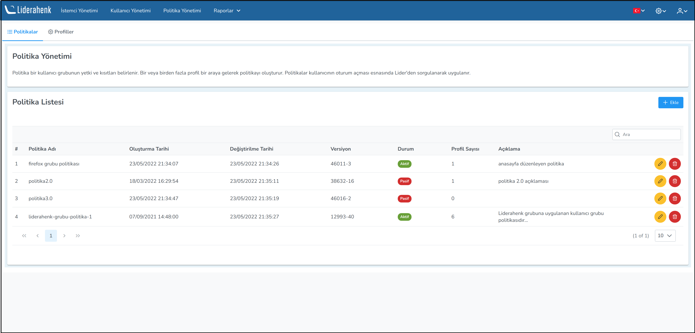

**POLİTİKA**

Bir ya da daha fazla çalıştırılabilen profillerin bir araya gelmesi ile oluşturulur. Politika ile eklentilerin sağladığı imkanların-kısıtlamaların bir kitlenin özelliklerine göre işletilmesi sağlanabilir. Kullanıcı grubuna uygulanırlar.
Politika kullanıcı grubuna atandıktan sonraki ile kullanıcı oturumu açması esnasında Lider'den sorgulanarak uygulanır.

