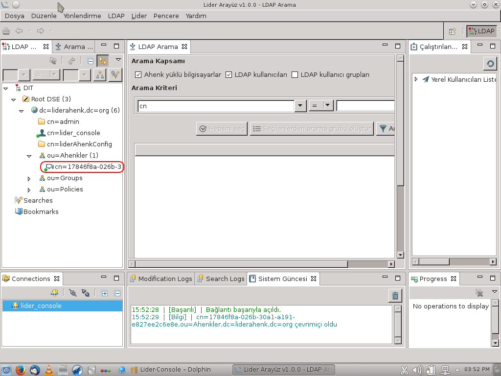

#  LiderAhenk OVA
&nbsp;&nbsp;&nbsp;&nbsp;&nbsp;&nbsp;Bu Virtualbox dosyası aşağıdaki bilgileri içermektedir. **Virtualbox > Dosya > Aygıtı İçe Aktar** yolu ile içe aktararak kullanabilirsiniz.

**İşletim Sistemi :** Pardus Kurumsal 5
**Kullanıcı Adı:** Pardus
**Şifre:** lider

**Donanım**
2 GB Ram
1 CPU
18 GB Disk

**Openldap(Slapd)**
| Kullanıcı	| Şifre |
| ------ | ------ |
|  root  |  ssifre  |


**Veritabanı(MariaDB)**

| Kullanıcı| Şifre |
| ------ | ------ |
|  root |  msifre  |

**Ejabber-XMMP**

| Kullanıcı	| Şifre |
| ------ | ------ |
| admin | easifre |
| lider_console | elcsifre |
| lider_sunucu | elssifre |

**Lider Console**

| Kullanıcı| Şifre |
| ------ | ------ |
| admin | asifre |
| lider_console | lcsifre |
| config | csifre |


## Lider Sunucu Ayarları
 Lider Sunucu için belirlediğiniz sanal makinanın ip adresini;

* **/etc/hosts** dosyası altındaki 'ip_adresi' alanına;

```sh
ip_adresi lider.liderahenk.org
ip_adresi ldap.liderahenk.org
ip_adresi ds.liderahenk.org
ip_adresi db.liderahenk.org
ip_adresi im.liderahenk.org 
```

* **/opt/lider-distro-1.0.0-SNAPSHOT/etc/tr.org.liderahenk.cfg** dosyasında 
```sh
xmpp.host = ip_adresi
```

ve 

* ```sh
file.server.host = ip_adresi
```
tanımlayarak karaf servisi;

* ```sh
cd /opt/lider-distro-1.0.0-SNAPSHOT/bin/
./karaf
./start
```

komutları ile başlatılmalıdır.

## Ahenk Kurulumu

&nbsp;&nbsp;&nbsp;&nbsp;&nbsp;&nbsp;Masaüstündeki lider-ahenk-installer dizini altında  lider-ahenk-installer simgesine tıklayarak kuruluma başlayabilirsiniz.


&nbsp;&nbsp;&nbsp;&nbsp;&nbsp;&nbsp;Bu işlemlerden sonra ahenk bilgisayarda kullanıcı  oturumu kapatılarak yeniden giriş yapılır. **LiderAhenk Kullanıcı Sözleşmesi** onaylanarak devam edilir.

## Lider Console Örnek Bağlantı

&nbsp;&nbsp;&nbsp;&nbsp;&nbsp;&nbsp; Masaüstündeki **Lider Console** dizini altından **lider-console** simgesine tıklanır;


&nbsp;&nbsp;&nbsp;&nbsp;&nbsp;&nbsp;**lider_console** bağlantısına tıklayarak **Ahenkler** altında eklenen ahenk bilgisayarlarını görebilirsiniz.


